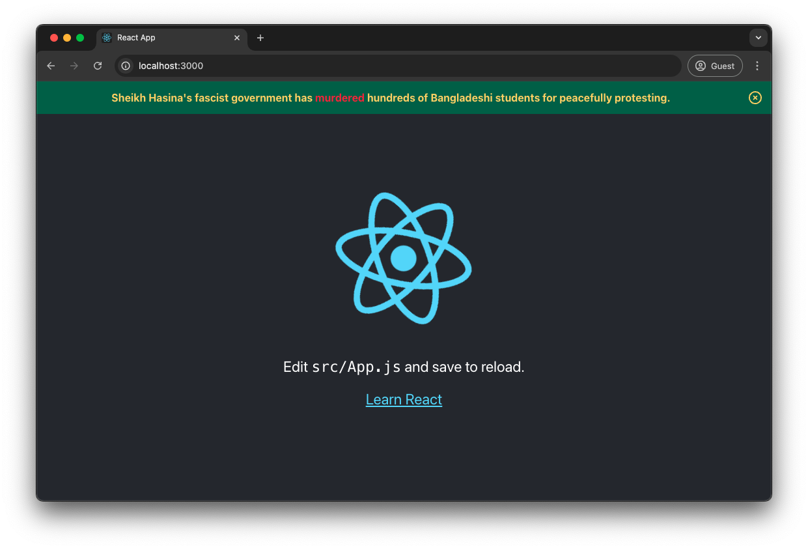
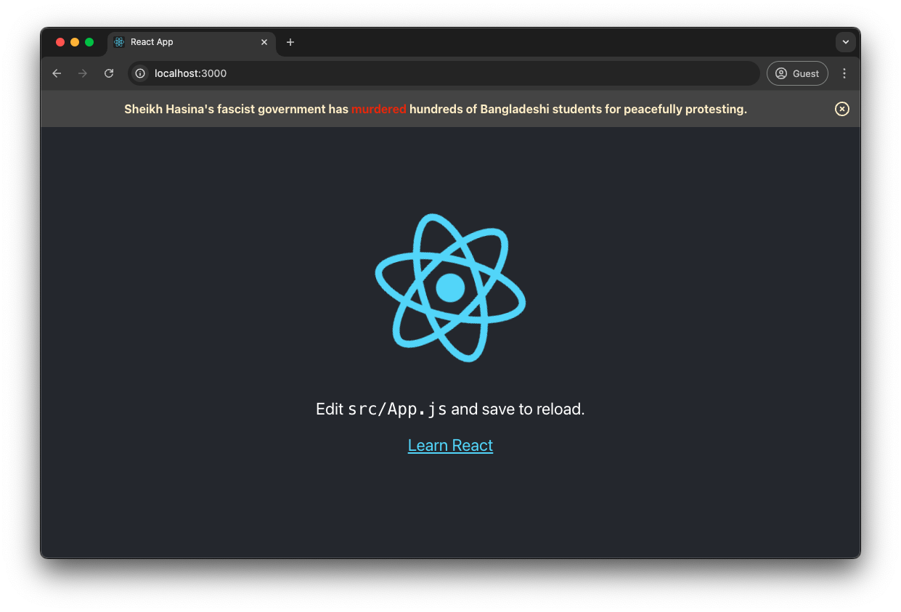
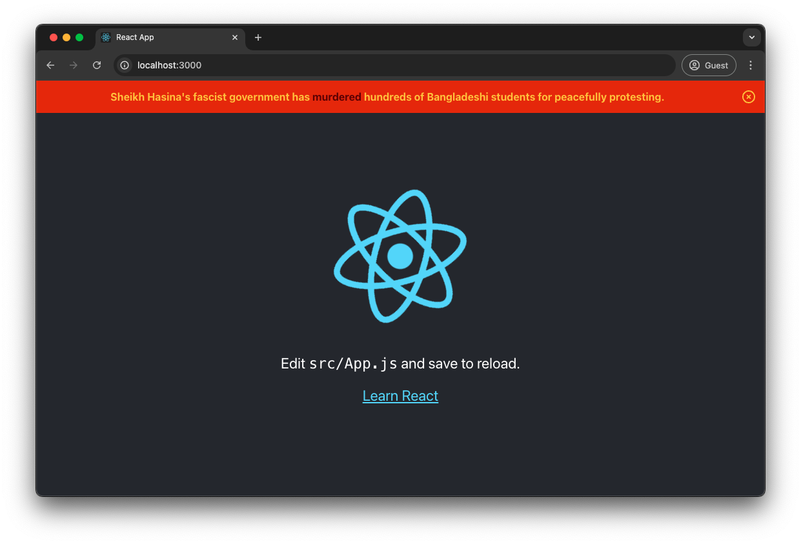
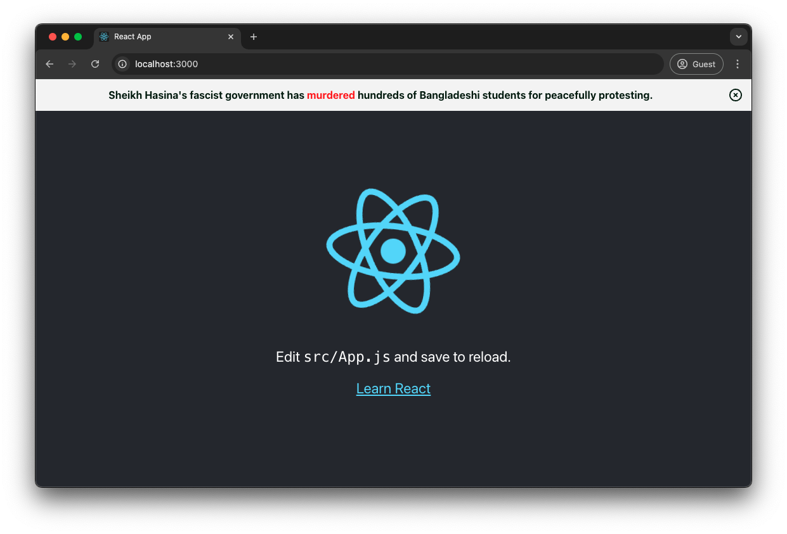
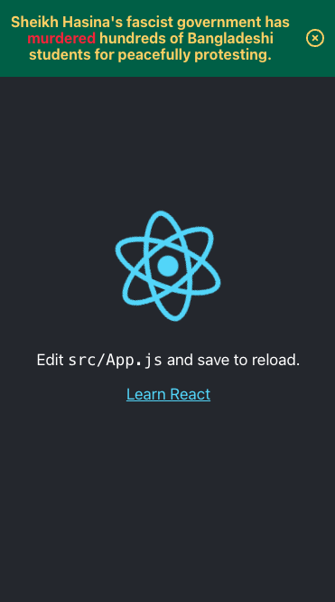
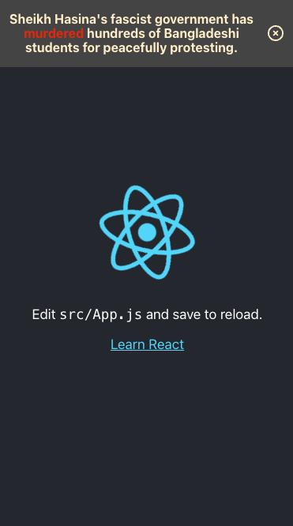
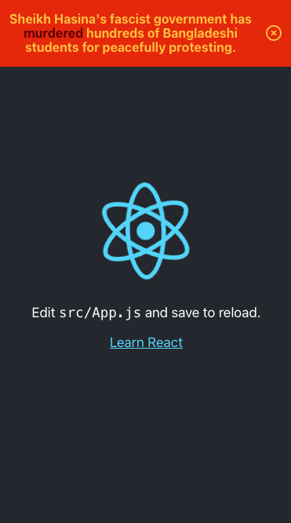
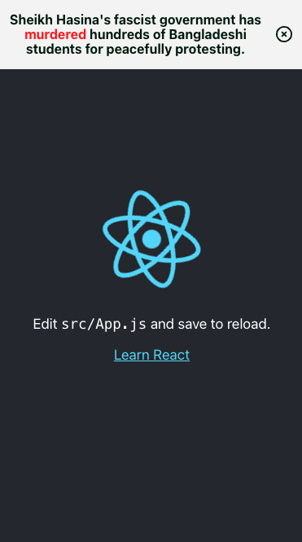

# People's Banner for Bangladesh :bangladesh:

The website contains badgers and banners that can be used in GitHub profiles and READMEs to show support for the anti-discrimination movement led by the students of Bangladesh against the fascist government.

> If you'd like to request a variation in color, styles, or text for any of these, please don't hestitate to create an issue with details, and I will try my best to accommodate.

# Badge

The following badge can be used on any GitHub profiles or READMEs.

```md
[](https://www.aljazeera.com/program/newsfeed/2024/7/24/bangladeshs-deadly-protests-explained)
```

[](https://www.aljazeera.com/program/newsfeed/2024/7/24/bangladeshs-deadly-protests-explained)

# GitHub Banner

The following banners can be used on top of GitHub project READMEs in show solidarity with Bangladeshi students.

```md
[](https://www.aljazeera.com/program/newsfeed/2024/7/24/bangladeshs-deadly-protests-explained)
```

[](https://www.aljazeera.com/program/newsfeed/2024/7/24/bangladeshs-deadly-protests-explained)

```md
[](https://www.aljazeera.com/program/newsfeed/2024/7/24/bangladeshs-deadly-protests-explained)
```

[](https://www.aljazeera.com/program/newsfeed/2024/7/24/bangladeshs-deadly-protests-explained)

```md
[](https://www.aljazeera.com/program/newsfeed/2024/7/24/bangladeshs-deadly-protests-explained)
```

[](https://www.aljazeera.com/program/newsfeed/2024/7/24/bangladeshs-deadly-protests-explained)

```md
[](https://www.aljazeera.com/program/newsfeed/2024/7/24/bangladeshs-deadly-protests-explained)
```

[](https://www.aljazeera.com/program/newsfeed/2024/7/24/bangladeshs-deadly-protests-explained)

# React Banner

A React banner component is also available to put at the top of any website. The banner offers configurable options, and also includes a close button that uses local storage to retain the closed state.

## Installation

Install the banner directly from this repository:

```bash
npm install 'https://gitpkg.vercel.app/alvii147/peoples-banner-for-bangladesh/react/react-peoples-banner-for-bangladesh?main'
```

## Usage

Once installed, you can use it directly in your React app:

```jsx
// App.js
import logo from './logo.svg';
import './App.css';
import PeoplesBannerForBangladesh from 'react-peoples-banner-for-bangladesh';

function App() {
  return (
    <div className="App">
      <PeoplesBannerForBangladesh />
      <header className="App-header">
        
        <p>
          Edit <code>src/App.js</code> and save to reload.
        </p>
        <a
          className="App-link"
          href="https://reactjs.org"
          target="_blank"
          rel="noopener noreferrer"
        >
          Learn React
        </a>
      </header>
    </div>
  );
}

export default App;
```

The `variant` prop can be set to one of `green`, `black`, `red`, or `white`:

## Web View









## Mobile View

`variant='green'` | `variant='black'` | `variant='red'` | `variant='white'`
--- | --- | --- | ---
 |  |  | 

## Props

Property | Description | Type | Default
--- | --- | --- | ---
variant | Variant of banner | `green`
backgroundColor | Background color of banner | `#006A4E`
foregroundColor | Foreground color of banner | `#FFD666`
emphasisColor | Color of "murdered" text | `#F42A41`
link | Redirect link of banner when on click | `https://www.aljazeera.com/program/newsfeed/2024/7/24/bangladeshs-deadly-protests-explained`
